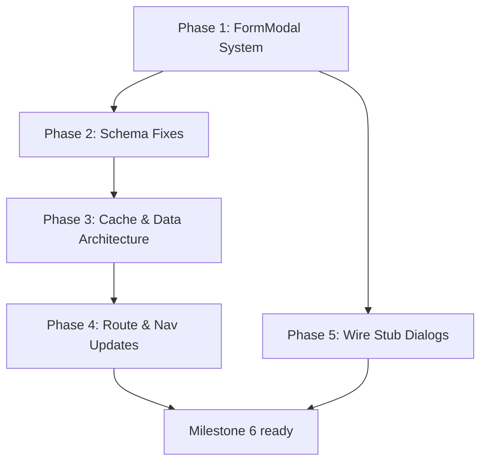

# Milestone 5.5 — PRD v3.2.0 Infrastructure

> **Implementation Plan — Code-Level Detail**
> **Created:** 2026-04-02
> **Status:** Pending Approval
> **Depends On:** Milestones 1–5 (all completed)

---

## Overview

This milestone aligns the existing codebase with PRD v3.2.0 by introducing:

1. **Reusable FormModal system** — eliminates ~300 lines of duplicated dialog boilerplate
2. **Prisma schema fixes** — corrects 5 field name mismatches between schema and PRD
3. **Cache & data architecture** — creates `lib/cache.ts`, `lib/types.ts`, `lib/queries.ts`
4. **Route & navigation updates** — renames Kanban→Tâches, adds Production nav
5. **Wire stub dialogs** — connects Phase and SubPhase forms to their server actions

---

## Phase 1: Reusable FormModal System

### 1.1 Create `components/shared/form-modal.tsx`

**Why:** Every dialog in the app repeats ~60 lines of identical boilerplate (open state, transition, Dialog wrapper, Header, Footer, Cancel/Submit buttons). The project needs 10+ more dialogs ahead.

**File:** `components/shared/form-modal.tsx`

```tsx
"use client"

import { type ReactNode } from "react"
import {
  Dialog,
  DialogContent,
  DialogDescription,
  DialogFooter,
  DialogHeader,
  DialogTitle,
  DialogTrigger,
} from "@/components/ui/dialog"
import { Button } from "@/components/ui/button"
import { Spinner } from "@/components/ui/spinner"
import { cn } from "@/lib/utils"

const SIZE_MAP = {
  sm: "sm:max-w-md",
  md: "sm:max-w-lg",
  lg: "sm:max-w-3xl",
  xl: "sm:max-w-5xl",
  "2xl": "sm:max-w-7xl",
} as const

interface FormModalProps {
  /** Controlled open state */
  open: boolean
  /** Called when open state changes */
  onOpenChange: (open: boolean) => void
  /** Dialog title */
  title: string
  /** Optional description below the title */
  description?: string
  /** Optional trigger element (renders DialogTrigger) */
  trigger?: ReactNode
  /** Dialog width preset */
  size?: keyof typeof SIZE_MAP
  /** Whether the form is submitting */
  isPending?: boolean
  /** Form submit handler */
  onSubmit: (e: React.FormEvent) => void
  /** Optional reset callback when closing */
  onReset?: () => void
  /** Submit button label */
  submitLabel?: string
  /** Submit button label when pending */
  submitPendingLabel?: string
  /** Cancel button label */
  cancelLabel?: string
  /** Whether to show cancel button — default true */
  showCancel?: boolean
  /** Additional className for DialogContent */
  className?: string
  /** Form fields (children) */
  children: ReactNode
}

export function FormModal({
  open,
  onOpenChange,
  title,
  description,
  trigger,
  size = "md",
  isPending = false,
  onSubmit,
  onReset,
  submitLabel = "Enregistrer",
  submitPendingLabel = "Enregistrement...",
  cancelLabel = "Annuler",
  showCancel = true,
  className,
  children,
}: FormModalProps) {
  function handleOpenChange(nextOpen: boolean) {
    if (!nextOpen && onReset) {
      onReset()
    }
    onOpenChange(nextOpen)
  }

  return (
    <Dialog open={open} onOpenChange={handleOpenChange}>
      {trigger && <DialogTrigger asChild>{trigger}</DialogTrigger>}
      <DialogContent
        className={cn(
          SIZE_MAP[size],
          "max-h-[90vh] overflow-y-auto",
          className
        )}
      >
        <form onSubmit={onSubmit}>
          <DialogHeader>
            <DialogTitle>{title}</DialogTitle>
            {description && (
              <DialogDescription>{description}</DialogDescription>
            )}
          </DialogHeader>

          <div className="py-6">{children}</div>

          <DialogFooter>
            {showCancel && (
              <Button
                type="button"
                variant="outline"
                onClick={() => handleOpenChange(false)}
                disabled={isPending}
              >
                {cancelLabel}
              </Button>
            )}
            <Button type="submit" disabled={isPending}>
              {isPending && <Spinner data-icon="inline-start" />}
              {isPending ? submitPendingLabel : submitLabel}
            </Button>
          </DialogFooter>
        </form>
      </DialogContent>
    </Dialog>
  )
}
```

**Props Summary:**

| Prop | Type | Default | Purpose |
|------|------|---------|---------|
| `open` | `boolean` | required | Controlled open state |
| `onOpenChange` | `(open: boolean) => void` | required | Open state setter |
| `title` | `string` | required | Dialog title |
| `description` | `string?` | — | Subtitle below title |
| `trigger` | `ReactNode?` | — | Optional trigger button |
| `size` | `sm\|md\|lg\|xl\|2xl` | `md` | Width preset |
| `isPending` | `boolean` | `false` | Disables form + shows spinner |
| `onSubmit` | `(e: FormEvent) => void` | required | Form submit handler |
| `onReset` | `() => void?` | — | Called when closing |
| `submitLabel` | `string` | `"Enregistrer"` | Button text |
| `submitPendingLabel` | `string` | `"Enregistrement..."` | Button text while pending |
| `cancelLabel` | `string` | `"Annuler"` | Cancel button text |
| `showCancel` | `boolean` | `true` | Whether to show Cancel |
| `children` | `ReactNode` | required | Form fields |

---

### 1.2 Create `components/shared/form-section.tsx`

**Why:** The project dialog has a numbered section pattern (01 — Informations Générales, 02 — Budget & Finances, etc.) that will be reused in other multi-section forms.

**File:** `components/shared/form-section.tsx`

```tsx
import { type ReactNode } from "react"

interface FormSectionProps {
  /** Section number (displayed as badge) */
  number: string
  /** Section title */
  title: string
  /** Form fields */
  children: ReactNode
}

export function FormSection({ number, title, children }: FormSectionProps) {
  return (
    <div className="space-y-6">
      <div className="flex items-center gap-3">
        <div className="flex h-8 w-8 items-center justify-center rounded-lg bg-primary/10 text-primary">
          <span className="text-xs font-bold">{number}</span>
        </div>
        <h3 className="text-sm font-bold uppercase tracking-widest text-foreground/80">
          {title}
        </h3>
        <div className="h-px flex-1 bg-border/60" />
      </div>
      <div className="grid gap-4">{children}</div>
    </div>
  )
}
```

---

### 1.3 Refactor `project-dialog.tsx`

**Current:** 392 lines — manages its own Dialog, Header, Footer, open state, Cancel/Submit  
**After:** ~280 lines — uses `FormModal` + `FormSection`, only contains form fields and submit logic

**Changes:**
- Remove all Dialog/DialogContent/DialogHeader/DialogFooter/DialogTrigger imports
- Remove `open` state management boilerplate
- Remove Cancel/Submit button JSX
- Import and use `FormModal` + `FormSection`
- Keep: form state, TVA calculation, handleSubmit, all field JSX

**Before (simplified):**
```tsx
return (
  <Dialog open={open} onOpenChange={setOpen}>
    <DialogTrigger asChild>...</DialogTrigger>
    <DialogContent className="sm:max-w-5xl ...">
      <form onSubmit={handleSubmit}>
        <DialogHeader>...</DialogHeader>
        {/* 250 lines of form fields */}
        <DialogFooter>
          <Button variant="outline" onClick={() => setOpen(false)}>Annuler</Button>
          <Button type="submit" disabled={isPending}>...</Button>
        </DialogFooter>
      </form>
    </DialogContent>
  </Dialog>
)
```

**After (simplified):**
```tsx
return (
  <FormModal
    open={open}
    onOpenChange={setOpen}
    title={project ? "Modifier le projet" : "Créer un nouveau projet"}
    description={project ? "Modifiez les informations..." : "Remplissez..."}
    trigger={<Button>{project ? "Modifier" : "Créer un projet"}</Button>}
    size="xl"
    isPending={isPending}
    onSubmit={handleSubmit}
    submitLabel={project ? "Enregistrer" : "Créer"}
    submitPendingLabel="En cours..."
  >
    <div className="grid gap-10">
      <FormSection number="01" title="Informations Générales">
        {/* field JSX unchanged */}
      </FormSection>
      <FormSection number="02" title="Budget & Finances">
        {/* field JSX unchanged */}
      </FormSection>
      <FormSection number="03" title="Planning & Statut">
        {/* field JSX unchanged */}
      </FormSection>
    </div>
  </FormModal>
)
```

**Lines removed:** ~80 (dialog boilerplate + footer)  
**Lines added:** ~10 (FormModal + FormSection wrappers)  
**Net savings:** ~70 lines

---

### 1.4 Refactor `phase-dialog.tsx`

**Current:** 291 lines  
**Changes:** Replace Dialog wrapper with `FormModal size="md"`  
**Net savings:** ~50 lines  

---

### 1.5 Refactor `subphase-dialog.tsx`

**Current:** 228 lines  
**Changes:** Replace Dialog wrapper with `FormModal size="md"`  
**Also fix:** Move `import { Plus } from "lucide-react"` from line 227 (bottom) to top of file  
**Net savings:** ~50 lines  

---

### 1.6 Refactor `client-dialog.tsx`

**Current:** 232 lines  
**Changes:** Replace Dialog wrapper with `FormModal size="lg"`  
**Net savings:** ~40 lines  

---

### 1.7 Delete `create-client-dialog.tsx` & Update Import

**Problem:** Two separate client dialog components exist:
- `components/client/client-dialog.tsx` — full create/edit with Zod validation
- `components/client/create-client-dialog.tsx` — create-only duplicate without Zod

**Action:**
1. Delete `components/client/create-client-dialog.tsx` (195 lines)
2. Update the single import in `app/(dashboard)/unite/[unitId]/clients/clients-page-client.tsx`:
   ```diff
   - import { CreateClientDialog } from "@/components/client/create-client-dialog"
   + import { ClientDialog } from "@/components/client/client-dialog"
   ```
3. Update the JSX usage to match `ClientDialog` props

**Net savings:** 195 lines deleted

---

## Phase 2: Prisma Schema Fixes

### 2.1 Field Renames

All renames are in `prisma/schema.prisma`:

| # | Model | Current Field | Correct Field | Line | `@map` needed |
|---|-------|---------------|---------------|------|---------------|
| 1 | `User` | `jobeTitle` | `jobTitle` | 72 | `@map("jobeTitle")` |
| 2 | `Invitation` | `jobeTilte` | `jobTitle` | 170 | `@map("jobeTilte")` |
| 3 | `Notification` | `notification` | `message` | 207 | `@map("notification")` |
| 4 | `Company` | `state` | `wilaya` | 105 | `@map("state")` |

**Strategy:** Use `@map("old_name")` on each renamed field to avoid destructive migration. This renames the Prisma client field while keeping the database column name unchanged. No data loss, no migration needed.

**Example change (schema.prisma line 72):**
```diff
- jobeTitle String?
+ jobTitle  String?  @map("jobeTitle")
```

### 2.2 Add `companyId` to Lane Model

**Current `Lane` model (lines 431-443):**
```prisma
model Lane {
  id        String   @id @default(uuid())
  name      String
  createdAt DateTime @default(now())
  updatedAt DateTime @updatedAt
  Unit      Unit     @relation(fields: [unitId], references: [id])
  unitId    String
  Tasks     Task[]
  order     Int      @default(0)
  color     String?

  @@index([unitId])
}
```

**Change — add `companyId` + relation:**
```diff
  model Lane {
    id        String   @id @default(uuid())
    name      String
    createdAt DateTime @default(now())
    updatedAt DateTime @updatedAt
    Unit      Unit     @relation(fields: [unitId], references: [id])
    unitId    String
+   companyId String
+   Company   Company  @relation(fields: [companyId], references: [id])
    Tasks     Task[]
    order     Int      @default(0)
    color     String?

    @@index([unitId])
+   @@index([companyId])
  }
```

**Also requires:** Adding `Lane Lane[]` relation to `Company` model (around line 124).

### 2.3 Code References to Update After Renames

Files that reference the old field names (from grep results):

| Old Field | File | Line(s) | Change |
|-----------|------|---------|--------|
| `jobeTitle` | `app/api/webhooks/clerk/route.ts` | 97 | `jobeTitle:` → `jobTitle:` |
| `jobeTilte` | `lib/validators.ts` | 122 | `jobeTilte:` → `jobTitle:` |
| `jobeTilte` | `app/api/webhooks/clerk/route.ts` | 97 | `pendingInvitation.jobeTilte` → `.jobTitle` |
| `state` | `lib/validators.ts` | 17 | `state:` → `wilaya:` |
| `state` | `actions/onboarding.ts` | 68 | `state: companyData.state` → `wilaya: companyData.wilaya` |
| `state` | `actions/company.ts` | 78 | `state: validData.state` → `wilaya: validData.wilaya` |
| `state` | `components/onboarding/step-company.tsx` | 144, 147, 148, 153, 166, 167 | All `state` → `wilaya` |
| `state` | `app/(dashboard)/company/[companyId]/settings/company-settings-form.tsx` | 52, 213-231 | All `state` → `wilaya` |
| `notification` | *(no current consumer)* | — | No code changes needed yet |

**Total files to update:** 6 files, ~20 line changes

### 2.4 Migration Command

Since we're using `@map()`, no actual database migration is needed — just:

```bash
pnpm prisma generate   # Regenerate Prisma Client with new field names
pnpm prisma validate   # Verify schema is valid
```

For the `Lane.companyId` addition (new column), we need:

```bash
pnpm prisma migrate dev --name add-lane-company-id
```

**Note:** Since Lane has no data yet (Kanban not implemented), this is safe.

---

## Phase 3: Cache & Data Architecture

### 3.1 Create `lib/cache.ts`

**File:** `lib/cache.ts`  
**Source of truth:** PRD §4.3

All cache tag constants from PRD:

```typescript
// lib/cache.ts
// Cache Tag Taxonomy — PRD §4.3
// All tag constants used by lib/queries.ts and actions/*

// Static
export const PLANS_TAG = 'plans'

// Company
export const companyTag = (id: string) => `company:${id}`
export const companyTeamTag = (id: string) => `company:${id}:team`

// Subscription
export const subscriptionTag = (companyId: string) => `subscription:${companyId}`

// Unit
export const unitTag = (id: string) => `unit:${id}`
export const unitMembersTag = (id: string) => `unit:${id}:members`
export const unitProjectsTag = (id: string) => `unit:${id}:projects`
export const unitClientsTag = (id: string) => `unit:${id}:clients`
export const unitLanesTag = (id: string) => `unit:${id}:lanes`
export const unitTasksTag = (id: string) => `unit:${id}:tasks`
export const unitTagsTag = (id: string) => `unit:${id}:tags`
export const unitProductionsTag = (id: string) => `unit:${id}:productions`

// Project
export const projectTag = (id: string) => `project:${id}`
export const projectPhasesTag = (id: string) => `project:${id}:phases`
export const projectGanttTag = (id: string) => `project:${id}:gantt`
export const projectTeamTag = (id: string) => `project:${id}:team`
export const projectTimeTag = (id: string) => `project:${id}:time`

// Phase
export const phaseTag = (id: string) => `phase:${id}`
export const phaseProductionTag = (id: string) => `phase:${id}:production`

// User
export const userTag = (id: string) => `user:${id}`
export const userTasksTag = (id: string) => `user:${id}:tasks`
export const userProjectsTag = (id: string) => `user:${id}:projects`
export const userAnalyticsTag = (id: string) => `user:${id}:analytics`
```

---

### 3.2 Create `lib/types.ts`

**File:** `lib/types.ts`  
**Source of truth:** PRD §3.3

Migrate and centralize all types currently in `components/project/types.ts`, plus add types from PRD:

```typescript
// lib/types.ts
// Centralized TypeScript interfaces — PRD §3.3
// Do not define types inline in components or actions.

import type { Role, Status, SubPhaseStatus } from '@prisma/client'

// ──── User ──────────────────────────
export interface UserWithRole {
  id: string
  clerkId: string
  name: string
  email: string
  role: Role
  companyId: string | null
  unitId: string | null
  jobTitle?: string | null
  avatarUrl?: string | null
}

// ──── Project ───────────────────────
export interface ProjectWithClient {
  id: string
  name: string
  code: string
  type: string
  montantHT: number
  montantTTC: number
  ods: Date | null
  delaiMonths: number
  delaiDays: number
  status: Status
  signe: boolean
  archived: boolean
  clientId: string
  unitId: string
  companyId: string
  createdAt: Date
  updatedAt: Date
  client: { id: string; name: string } | null
  unit: { id: string; name: string } | null
}

export interface ProjectWithPhases {
  id: string
  name: string
  montantHT: number
  phases: PhaseWithSubPhases[]
}

// ──── Phase ─────────────────────────
export interface PhaseWithSubPhases {
  id: string
  name: string
  code: string
  montantHT: number
  startDate: Date | null
  endDate: Date | null
  status: Status
  obs: string | null
  progress: number
  duration: number | null
  projectId: string
  createdAt: Date
  updatedAt: Date
  SubPhases: SubPhaseData[]
}

// ──── SubPhase ──────────────────────
export interface SubPhaseData {
  id: string
  name: string
  code: string
  status: SubPhaseStatus
  progress: number
  startDate: Date | null
  endDate: Date | null
  phaseId: string
  createdAt: Date
  updatedAt: Date
}

// ──── Team ──────────────────────────
export interface TeamMemberWithUser {
  id: string
  role: string
  teamId: string
  userId: string
  createdAt: Date
  updatedAt: Date
  user: {
    id: string
    name: string
    email: string
    avatarUrl: string | null
  }
}

// ──── Client ────────────────────────
export interface ClientWithProjects {
  id: string
  name: string
  wilaya: string | null
  phone: string | null
  email: string | null
  unitId: string
  companyId: string
  projects: { id: string; name: string; status: Status }[]
}
```

**After creation:**
1. Delete `components/project/types.ts` (83 lines)
2. Update all imports across the codebase:
   ```diff
   - import type { ProjectWithClient } from "./types"
   + import type { ProjectWithClient } from "@/lib/types"
   ```

**Files to update imports:**
- `components/project/project-dialog.tsx`
- `components/project/project-list.tsx`
- `components/project/project-overview.tsx`
- `components/project/project-team.tsx`
- `components/project/phase-list.tsx`
- Any other file importing from `@/components/project/types`

---

### 3.3 Create `lib/queries.ts`

**File:** `lib/queries.ts`  
**Source of truth:** PRD §3.2 + §4.4

This file centralizes ALL database read operations, each with `'use cache'`, `cacheTag()`, and `cacheLife()`.

**Functions to implement (from PRD §4.4):**

#### Company Domain
| Function | Cache Profile | Tags |
|----------|---------------|------|
| `getCompanyById(companyId)` | `cacheLife("days")` | `companyTag(id)` |
| `getCompanyKPIs(companyId)` | `cacheLife("hours")` | `companyTag(id)` |
| `getAllUnits(companyId)` | `cacheLife("hours")` | `companyTag(id)` |
| `getCompanyTeam(companyId)` | `cacheLife("hours")` | `companyTeamTag(id)` |
| `getSubscription(companyId)` | `cacheLife("hours")` | `subscriptionTag(companyId)` |
| `getPlans()` | `cacheLife("static")` | `PLANS_TAG` |

#### Unit Domain
| Function | Cache Profile | Tags |
|----------|---------------|------|
| `getUnitById(unitId)` | `cacheLife("days")` | `unitTag(id)` |
| `getUnitMembers(unitId)` | `cacheLife("hours")` | `unitMembersTag(id)` |
| `getUnitProjects(unitId, companyId)` | `cacheLife("hours")` | `unitProjectsTag(id)` |
| `getUnitClients(unitId, companyId)` | `cacheLife("hours")` | `unitClientsTag(id)` |
| `getUnitLanes(unitId)` | `cacheLife("seconds")` | `unitLanesTag(id)` |
| `getUnitTasks(unitId)` | `cacheLife("seconds")` | `unitTasksTag(id)` |
| `getUnitTags(unitId)` | `cacheLife("hours")` | `unitTagsTag(id)` |
| `getUnitProductions(unitId)` | `cacheLife("minutes")` | `unitProductionsTag(id)` |

#### Project Domain
| Function | Cache Profile | Tags |
|----------|---------------|------|
| `getProjectById(projectId, companyId)` | `cacheLife("minutes")` | `projectTag(id)` |
| `getProjectPhases(projectId)` | `cacheLife("minutes")` | `projectPhasesTag(id)` |
| `getGanttData(projectId)` | `cacheLife("minutes")` | `projectGanttTag(id)` |
| `getProjectTeam(projectId)` | `cacheLife("hours")` | `projectTeamTag(id)` |
| `getTimeEntries(projectId)` | `cacheLife("minutes")` | `projectTimeTag(id)` |
| `getPhaseProduction(phaseId)` | `cacheLife("minutes")` | `phaseProductionTag(id)` |

#### User Domain
| Function | Cache Profile | Tags |
|----------|---------------|------|
| `getUserById(clerkId)` | `cacheLife("days")` | `userTag(id)` |
| `getUserTasks(userId)` | `cacheLife("seconds")` | `userTasksTag(id)` |
| `getUserProjects(userId)` | `cacheLife("hours")` | `userProjectsTag(id)` |
| `getUserAnalytics(userId)` | `cacheLife("minutes")` | `userAnalyticsTag(id)` |

#### Never Cached
| Function | Strategy |
|----------|----------|
| `getNotifications(userId)` | `unstable_noStore()` |
| `getActivityLogs(companyId)` | `unstable_noStore()` |
| `getUnreadCount(userId)` | `unstable_noStore()` |
| `getInvitationStatus(invitationId)` | `unstable_noStore()` |

**Note:** Not all functions need full implementation now. Only implement functions that correspond to existing features (Company, Unit, Project, Client, Phase, Members). Future milestones will add Task, Lane, Production, etc.

---

### 3.4 Refactor Pages to Use `queries.ts`

**Pages with raw Prisma queries (from grep):**

| Page File | Current Raw Queries | Replace With |
|-----------|-------------------|--------------|
| `company/[companyId]/page.tsx` | `prisma.company.findUnique` | `getCompanyById()` |
| `company/[companyId]/settings/page.tsx` | `prisma.user.findUnique`, `prisma.company.findUnique` | `getUserById()`, `getCompanyById()` |
| `company/[companyId]/settings/billing/page.tsx` | `prisma.company.findUnique`, `prisma.plan.findMany` | `getCompanyById()`, `getPlans()` |
| `company/[companyId]/units/page.tsx` | `prisma.unit.findMany` | `getAllUnits()` |
| `company/[companyId]/users/page.tsx` | `prisma.user.findMany`, `prisma.invitation.findMany`, `prisma.unit.findMany` | `getCompanyTeam()`, etc. |
| `unite/[unitId]/page.tsx` | `prisma.user.findUnique`, `prisma.unit.findFirst`, `prisma.project.findMany` × 2 | `getUserById()`, `getUnitById()`, `getUnitProjects()` |
| `unite/[unitId]/clients/page.tsx` | `prisma.unit.findFirst`, `prisma.client.findMany` | `getUnitById()`, `getUnitClients()` |
| `unite/[unitId]/clients/[clientId]/page.tsx` | `prisma.client.findFirst` × 2, `prisma.unit.findFirst` | Cached query functions |
| `unite/[unitId]/members/page.tsx` | `prisma.user.findMany`, `prisma.invitation.findMany`, `prisma.unit.findFirst` | `getUnitMembers()`, `getUnitById()` |
| `unite/[unitId]/settings/page.tsx` | `prisma.user.findUnique`, `prisma.unit.findFirst` | `getUserById()`, `getUnitById()` |
| `unite/[unitId]/projects/page.tsx` | `prisma.unit.findFirst`, `prisma.project.findMany`, `prisma.client.findMany` | `getUnitById()`, `getUnitProjects()`, `getUnitClients()` |
| `unite/[unitId]/projects/[projectId]/page.tsx` | `prisma.project.findFirst`, `prisma.teamMember.findFirst` | `getProjectById()` |

**Total:** 12 page files, ~28 raw Prisma calls to replace

**Process per page:**
1. Remove `import { prisma } from "@/lib/prisma"` if the page only does reads
2. Remove inline helper functions (e.g., `async function getMembers()`)
3. Import the corresponding function from `@/lib/queries`
4. Replace all `prisma.xxx.findMany/findUnique/findFirst` with the cached query function

---

### 3.5 Update Server Actions → `revalidateTag()`

**Current state:** All 10 server action files use `revalidatePath()`.  
**Target state:** All use `revalidateTag()` per PRD §4.5 invalidation map.

**Action files to update (with exact changes):**

| File | Current `revalidatePath()` calls | New `revalidateTag()` calls (from PRD §4.5) |
|------|----------------------------------|---------------------------------------------|
| `actions/client.ts` | 4 calls | `unitClientsTag(unitId)` |
| `actions/company.ts` | 1 call | `companyTag(companyId)` |
| `actions/gantt-marker.ts` | 3 calls | `projectGanttTag(projectId)` |
| `actions/invitation.ts` | 4 calls | `unitMembersTag(unitId)`, `companyTeamTag(companyId)` |
| `actions/onboarding.ts` | 1 call | *(keep revalidatePath for `/dashboard` redirect)* |
| `actions/phase.ts` | 3 calls | `projectPhasesTag(projectId)`, `projectGanttTag(projectId)`, `projectTag(projectId)` |
| `actions/project.ts` | 4 calls | `unitProjectsTag(unitId)`, `projectTag(projectId)` |
| `actions/subphase.ts` | 3 calls | `projectPhasesTag(projectId)`, `projectTag(projectId)` |
| `actions/team.ts` | 2 calls | `projectTeamTag(projectId)`, `userProjectsTag(userId)`, `companyTeamTag(companyId)` |
| `actions/unit.ts` | 4 calls | `companyTag(companyId)`, `unitTag(unitId)` |

**Per file change pattern:**
```diff
- import { revalidatePath } from "next/cache"
+ import { revalidateTag } from "next/cache"
+ import { unitClientsTag } from "@/lib/cache"

  // Inside the action:
- revalidatePath(`/unite/${validData.unitId}/clients`)
+ revalidateTag(unitClientsTag(validData.unitId))
```

**Total:** 10 files, ~30 revalidation call replacements

---

## Phase 4: Route & Navigation Updates

### 4.1 Update `lib/nav.ts`

**Changes per PRD §16.2:**

| Section | Change | Line(s) |
|---------|--------|---------|
| ADMIN/OWNER unit nav | Rename "Kanban" → "Tâches", route → `/unite/[unitId]/tasks` | 73-76 |
| ADMIN/OWNER unit nav | Add "Production" item with Factory icon | After line 76 |
| ADMIN/OWNER unit nav | Import `Factory` from lucide-react | Line 1 |

**Exact change at line 72-76:**
```diff
  {
-   title: "Kanban",
-   url: `/unite/${unitId}/kanban`,
-   icon: Kanban,
+   title: "Tâches",
+   url: `/unite/${unitId}/tasks`,
+   icon: Kanban,
+ },
+ {
+   title: "Production",
+   url: `/unite/${unitId}/productions`,
+   icon: Factory,
  },
```

### 4.2 Create Route Placeholder Pages

**File 1:** `app/(dashboard)/unite/[unitId]/tasks/page.tsx`
- Placeholder page for Kanban board (Milestone 8)
- Renders `PageHeader` + `EmptyState` with "Bientôt disponible" message

**File 2:** `app/(dashboard)/unite/[unitId]/productions/page.tsx`
- Placeholder page for production monitoring (Milestone 9)
- Renders `PageHeader` + `EmptyState` with "Bientôt disponible" message

---

## Phase 5: Wire Stub Dialogs

### 5.1 Wire `PhaseDialog.handleSubmit`

**Current (stub — line 85-92 of `phase-dialog.tsx`):**
```tsx
const handleSubmit = (e: React.FormEvent) => {
  e.preventDefault()
  startTransition(async () => {
    toast.success(phase ? "Phase mise à jour" : "Phase créée")
    setOpen(false)
    onSuccess?.()
  })
}
```

**After (wired to server action):**
```tsx
const handleSubmit = (e: React.FormEvent) => {
  e.preventDefault()
  startTransition(async () => {
    const data = {
      name: formData.name,
      code: formData.code,
      montantHT: Number(formData.montantHT),
      startDate: formData.startDate,
      endDate: formData.endDate,
      status: formData.status as Status,
      obs: formData.obs || null,
      progress: Number(formData.progress),
      projectId,
    }

    let result
    if (phase) {
      result = await updatePhase({ id: phase.id, ...data })
    } else {
      result = await createPhase(data)
    }

    if (result.success) {
      toast.success(phase ? "Phase mise à jour" : "Phase créée avec succès")
      setOpen(false)
      onSuccess?.()
    } else {
      toast.error(result.error ?? "Une erreur est survenue")
    }
  })
}
```

**Also add imports:**
```tsx
import { createPhase, updatePhase } from "@/actions/phase"
```

### 5.2 Wire `SubPhaseDialog.handleSubmit`

Same pattern — wire to `createSubPhase()`/`updateSubPhase()` from `actions/subphase.ts`.

```tsx
import { createSubPhase, updateSubPhase } from "@/actions/subphase"

// In handleSubmit:
const data = {
  name: formData.name,
  code: formData.code,
  status: formData.status as SubPhaseStatus,
  progress: Number(formData.progress),
  startDate: formData.startDate,
  endDate: formData.endDate,
  phaseId,
}

let result
if (subPhase) {
  result = await updateSubPhase({ id: subPhase.id, ...data })
} else {
  result = await createSubPhase(data)
}
```

---

## Execution Order & Dependencies



| # | Phase | Files Created | Files Modified | Files Deleted | Estimated |
|---|-------|--------------|----------------|---------------|-----------|
| 1 | FormModal System | 2 | 5 | 1 | 2-3 hours |
| 2 | Schema Fixes | 0 | 7 | 0 | 1 hour |
| 3 | Cache & Data | 3 | 22 | 1 | 4-5 hours |
| 4 | Route & Nav | 2 | 1 | 0 | 30 min |
| 5 | Wire Stubs | 0 | 2 | 0 | 1 hour |
| **Total** | | **7** | **37** | **2** | **8-10 hours** |

---

## Verification Plan

### After Each Phase

| Phase | Verification |
|-------|-------------|
| Phase 1 | `pnpm typecheck` + `pnpm lint` + visually test project/client dialogs in browser |
| Phase 2 | `pnpm prisma validate` + `pnpm prisma generate` + `pnpm typecheck` |
| Phase 3 | `pnpm typecheck` + `pnpm lint` + verify pages load with cached data |
| Phase 4 | Verify nav items render correctly + placeholder pages load |
| Phase 5 | Manually test phase/subphase create + edit via dialog in browser |

### Final Verification

```bash
pnpm typecheck      # Zero errors
pnpm lint            # Zero errors  
pnpm format          # All files formatted
pnpm prisma validate # Schema valid
pnpm dev             # App starts without errors
```

Then visually inspect in browser:
- [ ] Project dialog opens/closes/submits
- [ ] Client dialog opens/closes/submits
- [ ] Phase dialog creates a real phase (not stub)
- [ ] SubPhase dialog creates a real subphase (not stub)
- [ ] Navigation shows "Tâches" and "Production"
- [ ] All pages load without errors

---

_End of Milestone 5.5 Implementation Plan_
